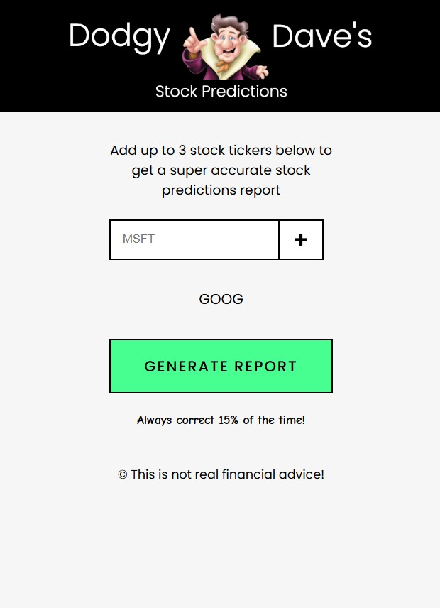

# Stock Performance Report Generator

A web application that generates AI-powered stock performance reports based on recent market data. Users can input stock tickers and receive comprehensive trading recommendations written in an engaging, analyst-style format.

## Live Demo

**Deployed Application**: [https://dodgydaves-stockrecos.pages.dev/](https://dodgydaves-stockrecos.pages.dev/)

## Screenshots




## Features

- **Multi-Stock Analysis**: Add multiple stock tickers for comparative analysis
- **Real-Time Data**: Fetches stock data from Polygon API for the past 3 days
- **AI-Generated Reports**: Creates personalized trading reports using OpenAI's language model
- **Professional Recommendations**: Provides buy/hold/sell guidance based on price movements
- **Performance Optimized**: Includes caching and rate limiting for improved response times
- **Security Enhanced**: Rate limiting and request validation to prevent abuse
- **Responsive Interface**: Functional design with loading states and error handling

## How It Works

1. **Input Tickers**: Enter stock ticker symbols (minimum 3 characters)
2. **Data Retrieval**: Application fetches recent price data via Polygon API
3. **AI Analysis**: Stock data is processed by an AI trading guru persona
4. **Report Generation**: Receive a comprehensive report with trading recommendations

## Technical Architecture

### Frontend
- Vanilla JavaScript with modern async/await patterns
- DOM manipulation for dynamic ticker display
- Form validation and error handling
- Responsive loading states

### APIs
- **Polygon API**: Stock market data retrieval with caching for improved performance
- **OpenAI API**: AI-powered report generation with rate limiting protection
- **Cloudflare Workers**: API proxy for secure key management and request optimization

### Performance & Security
- **Caching**: Implemented response caching to reduce API calls and improve load times
- **Rate Limiting**: Request throttling to prevent abuse and ensure service availability
- **Request Validation**: Input sanitization and ticker format validation
- **Error Recovery**: Graceful handling of API failures with user feedback

### Data Flow
```
User Input → Stock Data Fetch → AI Processing → Report Display
```

## API Integration

The application utilizes two Cloudflare Workers for API management:

- `polygon-api-worker`: Handles stock data requests with date range parameters
- `openai-api-worker`: Processes AI report generation with custom trading guru persona

## Report Style

Reports are generated in an engaging, conversational tone that:
- Analyzes 3-day price movements
- Uses colorful metaphors and trading terminology
- Provides clear buy/hold/sell recommendations
- Maintains a maximum length of 150 words

## Error Handling

- Network request failures are gracefully handled
- Invalid tickers display helpful error messages
- Loading states prevent multiple simultaneous requests
- User feedback is provided for all error scenarios

## Dependencies

- `/utils/dates`: Date utility functions for API date range parameters
- Modern browser with fetch API support
- Internet connection for real-time data retrieval

## Usage

1. Clone the repository
2. Set up the required Cloudflare Workers with appropriate API keys
3. Update the worker URLs in the fetch requests
4. Serve the application via a web server
5. Enter stock tickers and generate reports

## Design Notes

The application prioritizes functionality over visual design. The focus has been on building a robust backend architecture with proper caching, security measures, and reliable data processing rather than extensive UI/CSS styling. The interface is intentionally minimal to demonstrate the core functionality of AI-powered stock analysis.

## Security Notes

- API keys are managed server-side through Cloudflare Workers
- No sensitive credentials are exposed in the frontend code
- CORS is handled at the worker level for secure cross-origin requests